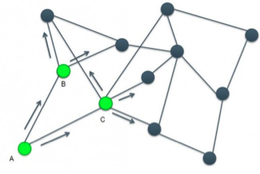
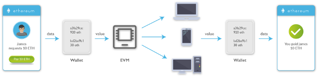

# Web3 Concepts

Before creating our own NFT, let’s take a look at the technologies and features that make NFTs work.

## Fungible vs. non-fungible

[Fungibility](https://www.investopedia.com/terms/f/fungibility.asp#:~:text=Fungibility%20is%20the%20ability%20of,equal%20value%20between%20the%20assets.) is essentially the ability to exchange an item for a similar item of the same value. Consider a five-dollar bill. It always equals the same amount anywhere in the world. You can exchange five one-dollar bills for a single five-dollar bill, and they are worth the same value all the time.

On the other hand, non-fungible items do not have the same value in comparison to each other. For example, an exact replica of the Mona Lisa is not equal in value to the original painting, despite being the same in every way. Non-fungible items are inherently unique and cannot be considered equivalent to any other item.

An item can be both fungible and non-fungible. For example, while two seats in economy class on a plane are worth the same price, one person may place sentimental value on a window seat, decreasing the value of every other seat for that person.

## Blockchain

A [blockchain](https://ethereum.org/en/developers/docs/intro-to-ethereum/#what-is-a-blockchain) is a public database or digital ledger that keeps track of transactions. It is replicated across several computer systems that are part of the chain. We’ll build our NFT on the Ethereum blockchain.

## Minting ERC721 tokens

Minting is the process of creating something for the first time, or in our case, publishing a unique instance of our [ERC721 token](https://docs.alchemy.com/alchemy/tutorials/how-to-create-an-nft/how-to-mint-a-nft) on the blockchain. [ERC-721](https://ethereum.org/en/developers/docs/standards/tokens/erc-721/) is the standard for creating an NFT, and an ERC721 token is a unique representation of digital content published to the Ethereum blockchain. No two tokens are ever the same, so each time you mint a new token with the same block of code, a new address will be generated.

## Smart contracts and NFTs

[Smart contracts](https://ethereum.org/en/developers/docs/smart-contracts/) are simple programs that are deployed to the blockchain and run as-is, meaning they’re not controlled by a user. We can use a smart contract to create and track our tokens.

An NFT is a digital store of data that conforms to the ERC-721 standard and lives on a public blockchain. NFTs contain information or data about the asset they represent, which could be a digital item like a Tweet or a physical item like a [hoodie](https://www.theguardian.com/fashion/2021/apr/15/virtual-hoodie-sells-non-fungible-token-nft-overpriced).

A smart contract can be considered an NFT if it implements the ERC-721 standard, and an NFT is an instance of a smart contract. Each time we mint a new NFT, we use the smart contract code that has been deployed to the blockchain.

## Public networks: Mainnet vs. Testnet

Ethereum uses multiple networks. The network used in production is usually referred to as Mainnet and the others, which are used for testing, are called Testnet. We’ll deploy the NFT we create to the [Mumbai Testnet](https://mumbai.polygonscan.com/), a proof-of-work Testnet for Polygon.

Note that when we eventually deploy our NFT, either to production or to the Mainnet, the transaction history and balances we have on the Mumbai Testnet will not carry over. Think of the Testnet as a public staging/development environment and the Mainnet as a production environment.

## Private networks

A network is considered private if its nodes are not connected to the public blockchain. You can run the Ethereum blockchain on a private network, like your local machine, or on a group of machines, like consortium networks, that are not accessible on the Mainnet or Testnet.

Running the Ethereum blockchain on a group of machines like an intranet would require validating transactions with a [node](https://ethereum.org/en/developers/docs/nodes-and-clients/), an Ethereum software running on a client that verifies blocks and transaction data.

[HardHat](https://hardhat.org/) and [Ganache](https://www.trufflesuite.com/ganache) are two examples of Ethereum blockchain development environments that you can run on your local machine to compile, test, deploy, and debug your smart contract application.

We’ll run our application on a public network so that it can be accessed by anyone connected to the network.

## Faucets

To test our application, we need to get Ether (ETH), the Ethereum cryptocurrency, from a faucet. Faucets, like the [Mumbai Faucet](https://faucet.polygon.technology/), are web apps that allow you to specify and send test ETH to an address, which you can then use to complete transactions on a Testnet.

The price of ETH on exchanges is determined by transactions occurring on the Mainnet at any given time. If you choose to run your Ethereum application on a private network, you don’t need test ETH.

## Nodes and clients

As previously mentioned, nodes verify blocks and transaction data. You can create your own node using clients like [Geth](https://geth.ethereum.org/downloads/) and [OpenEthereum](https://github.com/openethereum/openethereum/releases/) and contribute to the Ethereum blockchain by validating transactions and blocks on the blockchain.

You can skip the process of creating your own node and instead use one hosted on the cloud with a [node-as-a-service](https://ethereum.org/en/developers/docs/nodes-and-clients/nodes-as-a-service/) platform like [Alchemy](https://www.alchemyapi.io/) or [Moralis](https://moralis.io/). We can quickly move from development to production and ensure that we get important metrics for our application.

## Minting

Minting basically refers to the process of turning digital art into a part of the Ethereum blockchain as a public ledger. NFTs ensure representation for your digital artwork. At the same time, it also ensures that the artwork can be flexibly traded or purchased in the market.
One thing to note is that every transaction on the blockchain has a cost. So when you want to mint, buy or sell an NFT, you need to pay the price called gas fee.

## Gas Fees

Gas fees are payments made by users to compensate for the computing energy required to process and validate transactions on the Ethereum blockchain. A higher gas limit means that you must do more work to execute a transaction using crypto or a smart contract.

For this reason we will use a MongoDB to store non-static metadata, like user preferences or tags on products, so we dont't need to pay a gas fee.

## Metadata

As mentioned above Minting is pretty much a 3 step process

1. Upload the image to IPFS
2. Create and upload a metadata JSON file to IPFS
3. Pin the CID that is returned for each of these

The metadata file can contain multiple keys as many as you like, however you must have the 3 required keys: name, description and image.

## Wallets

A cryptocurrency wallet is a device or program that stores your cryptocurrency keys and allows you to access your tokens. Your wallet is the Web3 equivalent of your bank account.

Each wallet can have multiple addresses attached to it. A wallet address is similar to an account number in traditional banking.

Your wallet is accessed using a private cryptocurrency key or seed phrase. This is the same as a master password or digital login that you might have for an online bank, with one important difference - **anyone who has your private key can access and sign transactions**.

You should **never share** your private keys. Anyone with access to your private keys can access your funds, and they can be permanently lost.

MetaMask is one of the most popular and comprehensive Web3 wallets: [https://metamask.io/](https://metamask.io/)

## Signing

"Signing" in Web3 is the process of creating a digital signature using a combination of your wallet's private keys, cryptography, and encryption.

When you sign anything using your wallet, the receiving address (or signee) decrypts and verifies the request was sent by your private key and completes the transaction.

## Smart Contract

Smart contracts were first proposed in the early 1990s by Nick Szabo, who coined the term, using it to refer to "a set of promises, specified in digital form, including protocols within which the parties perform on these promises".

A smart contract is a computerized transaction protocol that executes the term of a contract. It automatically executes on the blockchain when specific conditions are met.

## RPC nodes

RPC node, or **r**emote **p**rocedure **c**all nodes, are responsible for storing and propagating transactions in the network. They are servers that provide public access points to blockchain networks and are used by dapps to interact with and read data from blockchains via APIs (such as Moralis' APIs).

As shown in the image below, node A broadcasts a transaction to node B and node C in the network. The nodes (A, B, and C) then verify this transaction before forwarding it to their peers, and so on.

Self-hosting RPC nodes is possible, but requires quite extensive infrastructure, support, and management. Moralis APIs remove the need to self-host an RPC node.

## EVM

**E**thereum **V**irtual **M**achine, or EVM, is the engine in which transaction code gets executed. EVM enables the development of potentially thousands of different applications all on one platform.

Smart contracts written in smart contract-specific programming languages are compiled into "bytecode", which an EVM can read and execute.

All nodes execute this smart contract using their EVMs.

## ERC

ERC stands for "**E**thereum **R**equest for **C**omment," and "request for comment" which is derived from Ethereum improvement proposals (EIPs).

These describe standards for the Ethereum platform, including core protocol specifications, client APIs, and contract standards. Network upgrades are discussed separately in the Ethereum Project Management repository.

The most popular ERC standards are [ERC-20](https://ethereum.org/en/developers/docs/standards/tokens/erc-20/) and [ERC-721](https://ethereum.org/en/developers/docs/standards/tokens/erc-721/#top).

## NFT

A **n**on-**f**ungible **t**oken is a unique digital token that is stored on the blockchain. An NFT differs from tokens like ETH or BTC, or fungible tokens, as it's one-of-a-kind and cannot be replicated.

NFTs can be used to represent individual assets digitally, most commonly art, but also real estate, tickets, wine, and rare collectibles. They can also be used as a kind of "digital passport", allowing users to access gated communities, events, or websites.

NFT metadata describes all of an NFT's essential properties, including name, transaction history, total supply, and so on.

The [ERC-721](https://ethereum.org/en/developers/docs/standards/tokens/erc-721/#top) standard is often used to create NFTs.

## Layer-2 (L2)

Layer-2 (L2) refers to a secondary framework or protocol that is built on top of an existing layer-1 blockchain.

Layer-2 blockchains typically improve transaction speeds and cost efficiency. As layer-2 protocols continue to scale, mempool data gives builders looking to migrate or build new dapps the tools to create the best user experiences.

## Token

A token represents an asset or equity that can be traded with another token or digital asset. Tokens on the blockchain are immutable, meaning they have a fixed name, symbol, and total supply, unless or otherwise made mutable with the help of a smart contract.

The ERC-20 standard is the most popular option for deploying a token on EVM chains.

## Blockchains and Blocks

Blockchains are made up of "blocks" of data, and networks of nodes. Each block is a collection of transaction information, while each node holds a record of all verified transactions.

New blocks submitted to the network are verified by the nodes, and either added to the blockchain as immutable data or rejected if invalid.

Block varies depending on the blockchain. The Bitcoin network block size is limited to 1 MB, for example, whereas Ethereum blocks have no fixed size.

Each individual block can be identified by its own block number and block hash.

## Events

Events are EVM logs. Events are inheritable members of contracts. When you call them, they cause the arguments to be stored in the transaction’s log - a special data structure in the blockchain.

These logs are associated with the address of the contract, are incorporated into the blockchain, and stay there as long as a block is accessible (forever as of now, but this might change with Serenity). The log and its event data are not accessible from within contracts (not even from the contract that created them). Source: [solidity docs](https://docs.soliditylang.org/en/v0.8.13/contracts.html#events).

## Type 0 Transaction

Type 0 transactions are no longer used. They are legacy transactions previous to the Ethereum London hard fork that occurred in August 2021, which included the deployment of EIP-1559.

## Type 2 Transaction

Type 2 transactions are based on the EIP-1559 upgrades and include base fee, max priority fee, and max fee per gas fields instead of the gas price field. Blocknative's Gas Platform API and Gas Estimator support both type 2 and type 0 transactions.

## ENS Domains

**E**thereum **N**aming **S**ystem is a human-readable name corresponding to your wallet address. ENS domains are unique and come with a .**eth** extension. They follow the ERC-721 standard.

## Unstoppable Domains

Similar to ENS, Unstoppable Domains are human-readable names as NFTs. They follow the ERC-721 standard and come with various extensions such as ".crypto", ".nft", and ".blockchain".

## DeFi

Decentralized finance, commonly called DeFi, is a financial technology native to blockchains. The term comes from the fact that blockchains are not controlled by a single centralized entity (like a central bank, for example).

DeFi comprises many "traditional" financial protocols translated to the blockchain, including staking, lending, and borrowing.

DeFi also led to the creation of AMMs (automated market makers), which run decentralized exchanges.

## AMM

An automated market maker, or AMM, is a protocol that usually runs on a decentralized exchange. It provides automatic quotes for trades and replaces traditional buy-and-sell order liquidity with liquidity pools that anyone can use or join.

## IPFS

[As per their website](https://docs.ipfs.tech/concepts/what-is-ipfs/), IPFS is a distributed system for storing and accessing files, websites, applications, and data.

## Solana

Solana is a decentralized blockchain built to enable scalable, user-friendly dapps for the world.

## SPL Token

The **S**olana **P**rogram **L**ibrary is the full form of SPL analogous to ERC on Ethereum, but for the Solana blockchain.

The SPL token is the standard used to issue tokens on the Solana blockchain, similar to the ERC-20 standard used to issue tokens on Ethereum.

**[< Go to README](../README.md)**
